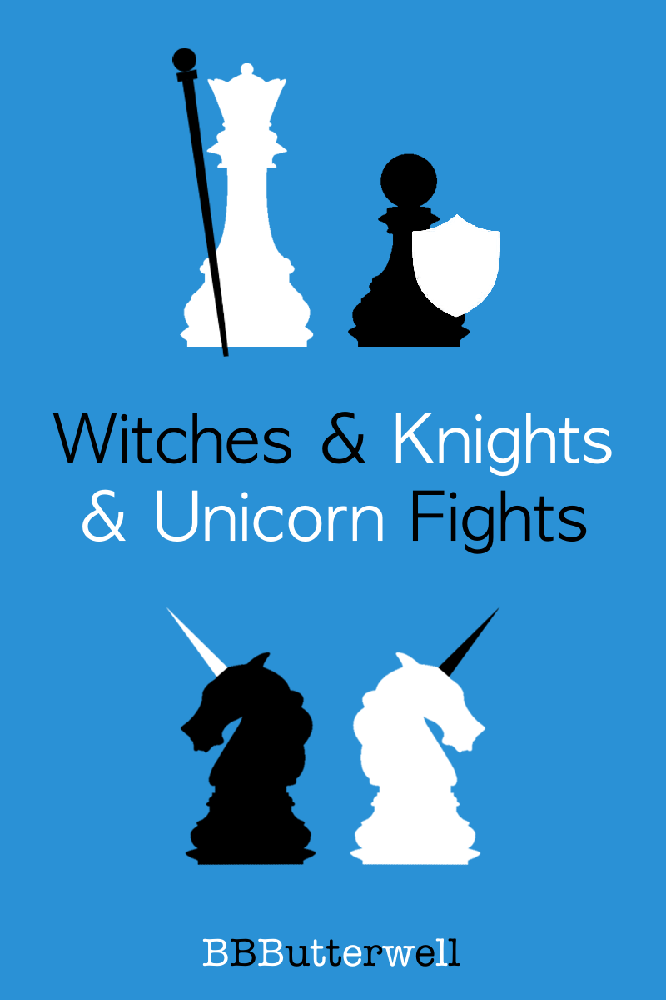

<b><i>Witches and Knights and Unicorn Fights</i></b> by <a xmlns:cc="http://creativecommons.org/ns#" href="https://github.com/bbbutterwell/book" property="cc:attributionName" rel="cc:attributionURL">B.B. Butterwell</a> is presently licensed under a <a rel="license" href="http://creativecommons.org/licenses/by-nc-nd/4.0/">Creative Commons Attribution-NonCommercial-NoDerivatives 4.0 International License</a>

## Witches & Knights & Unicorn Fights

Once upon a time, Maeve Morgan decided to be born... but she doesn't quite remember why.

The other day, a voice told her to tell her own story... but she's not so sure just where to start, or quite when to stop.

Maeve Morgan just wants to be left alone on her island, to shingle her roof, and maybe catch a Gnome someday.  

Meanwhile, in another Timeline...

Bardlii Noonstar embarks on a mission to chronicle the adventures of a common hooded rat, which the Sentient City of Owl claims is destined be the Realms' next greatest Known Hero.   

And somehow, all of this will become connected.

Which of our narrators will untangle this curious knot, by bravely and surely advancing the plot?

(Contains occasional swear words of the PG-13 variety)  

[participant in the [Royal Road's April Writathon](https://www.royalroad.com/blog/46/join-aprils-fun-events)]

 

---

Cover art images:

<a href="https://www.freevector.com/chequers-silhouette-vector-set-21849">FreeVector.com : Chess Pieces</a>
