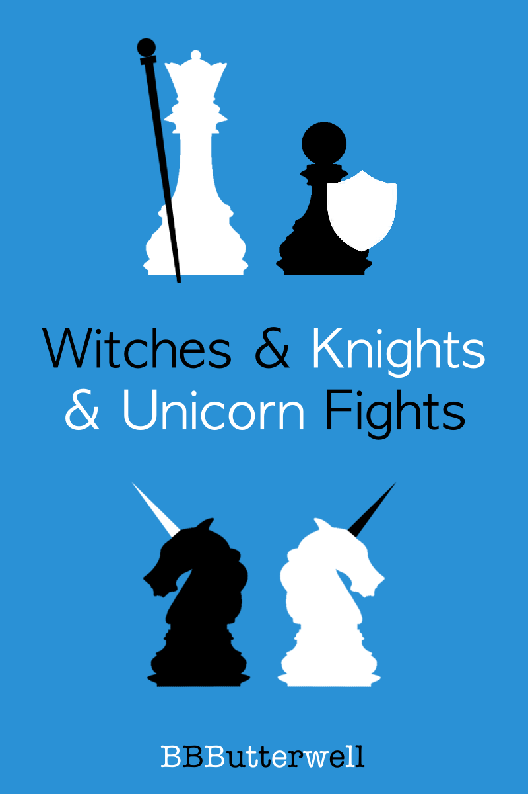

 <b><i>Witches and Knights and Unicorn Fights</i></b> by <a xmlns:cc="http://creativecommons.org/ns#" href="https://github.com/bbbutterwell/book" property="cc:attributionName" rel="cc:attributionURL">B.B. Butterwell</a> is presently licensed under a <a rel="license" href="http://creativecommons.org/licenses/by-nc-nd/4.0/">Creative Commons Attribution-NonCommercial-NoDerivatives 4.0 International License</a>

## Witches & Knights & Unicorn Fights

... and a hurried & hopeful submission for [Royal Road's April Writathon](https://www.royalroad.com/blog/46/join-aprils-fun-events)

---

Cover art images:

<a href="https://www.freevector.com/chequers-silhouette-vector-set-21849">FreeVector.com : Chess Pieces</a>
