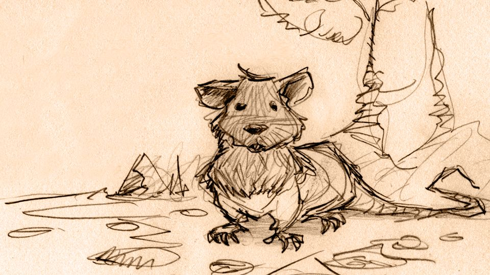

<small><i>Witches & Knights & Unicorn Fights</i> by <a xmlns:cc="http://creativecommons.org/ns#" href="https://github.com/bbbutterwell/book" property="cc:attributionName" rel="cc:attributionURL">BB.Butterwell</a> is licensed under a <a rel="license" href="http://creativecommons.org/licenses/by-sa/4.0/">Creative Commons Attribution-ShareAlike 4.0 International License</a></small>

*updated 2022-06-05*

**A disclaimer on the Author's style, from the Editor:** 

*Let the Reader be advised:*

*Every fourth chapter, the Author will indulge in the use of footnotes.[^footnotes] Readers are welcome to follow these things as they are found, read them all together at the end, or ignore them entirely. The choice is naturally theirs.*

*We promise the majority of chapters (those which are not of the every-fourth kind) will refrain  from footnotes altogether, instead exploring the elongation of exposition by other subjectively objectionable means - such as the famously avoidable run-on sentence - with liberal sprinklings of nonsensical syntaxes, questionable wordings, and peculiar punctuations. These things are to be found here and there, and all over the place.*

*Whether, then, the Reader is a lover or a hater of footnotery or sundry other sorts of inappropriately extended prosery, they are either-way advised to expect some longish yammering and wandering within the pages to follow - to both love or to not, amidst the rambling records of this curious plot.*

*Please approach the following pages with curiosity and optimism, or some suitable alternatives of your very own.*

---

## Prologue

Harlii The Hooded Harbinger (who was a hooded rat, at that) was a *True Known Hero* in their Time. There were, naturally, many other hooded rats in the World who stood out in their own particular ways, of course, from all the rest. That's how the World goes, you see - not every hooded rat, or other mortal thing for that matter, is created altogether equal. Some have hoods, for example. Some become True Known Heroes. Some manage both things, and then other things as well.

Every one of us, though, *is* created to become something considerably more than we started out as being. The choice is nonetheless ours to decide, after our creation has occurred. 

Harlii was created to become a *True Known Hero*, as it happens. And as is so often true of *those*, Harlii hadn't known at all that this was so of themselves, until they were called on to either be one, or not. The choice had been made *theirs* - to make right then, on the spot. 

And, as it happens, they then *did* choose to be one... and now here you and I both are. There wouldn't have been a story for me to share with you, otherwise. 

Or at least, not *this* one, which is Harlii's... and now is yours as well.

For this to have happened at all - for Harlii to have become the True, Known, Harbinging, Hooded Hero which they had, which then caused you and I to meet like this - they first had to *believe* that this was even possible at all - even for one, single moment. Just one. 

Belief in yourself doesn't need much of a window, you know, to get its foot squarely in your door. Then it's all over for you, but also begun: you've managed to see, and cannot then *un*-see, the True Hero that you might someday become. 

Maybe. There's always that *maybe*; the choice still has to be one's own, to make or to not. Remember? Otherwise, there was no choice at all - and then where's the Heroics in that?

So how then did Harlii come to be Truly Known as the *Hooded Harbinger of Foggy Hollows*, anyhow, you might ask. Well, I'll tell you a little bit. It took them traveling to a town on the Very Verge of Despair, on exactly the right wrong afternoon, and bearing no noteworthy news at all, to earn that title, fair and square. Then they became The Greatest Harbinger Ever Known. 

And this is where you will encounter your first footnote *[actually, the second -Ed.]*, if you wish to know more about the Very Verge of Despair, and other curious things. You may of course ignore the tiny link to the right of the Verge of Despair, [^vergeOfDespair] and instead continue reading the narrative unbroken, so that the story might flow a bit better. It depends on how your mind works best, when it comes to receiving ideas, and I can't know what that is, since it's your mind, and not mine. This is up to *you* - it's your story now. Now let's move on.

The Folk of Foggy Hollows (the town on the Very Verge, of which I speak), never needed more news, back then. It was a town quite known already for having had too much of that: *more news*. 

When the Great Change began creeping from the North and West, in the Year of the Nought, across the nameless plains of ill omen, and toward the Very Verge of Despair - beyond which by a mere stone's throw, the tiny town of Foggy Hollows sat squatly, awaiting that Final, Great Boot to drop (the Boot here, being mostly metaphor (mostly)) - the townsfolk wearily reacted with a practiced and collective sigh. *Wonderful*, they all thought (and not for the first time) - *here comes some more news*.

Shops closed (possibly "for good", again), people hammered extra boards across their shuttered windows (the town's old Window Boarder was always doing well, in spite of occasional spells of relative calm), and visitors to town were ominously told, once more, they had *best leave, before it was too late*. That's the kind of place Foggy Hollows was. The name too, really, should have been a clear clue. 

To *those* Folk, at least, news had only ever arrived as one sort alone: the very worst sort. Harbingers, therefore, were welcomed with that same enthusiasm - for who would ever want a bearer of news showing up, anyway, when news was known to never be good? 

There were signs at all the approaches to town, in fact, which read: **No more news required - Harbingers need not approach.** None in the town had ever thought for a moment that news might be anything other than wholly unwelcome. I think you get the idea. 

But then Harlii the hooded rat arrived, ignoring the sign (being unable to read at the time), and got busy being the Hero they had been created to be, by delivering a short and unremarkable prophecy... which we'll surely get to eventually.

And now I am getting *far* too ahead of things, here. I am not the right teller for this tale any more, and it is no longer for *me* to decide when we get there, just how, or even what for. 

That is all for Maevis B. Morgan to bring herself around to doing, in all the ways that Maevis goes about doing stories, which are entirely her own.

You'll meet Maeve in a short moment. I must now depart; I have been asked to bear witness to the starting of another tale of some other kind, and I am already running a hundred or more words behind. 

I hope you enjoy following the entangled tales of Maevis (Mae-Bee) Morgan and Harlii the Hooded Harbinger as much as I have enjoyed bearing witness to them, so far as they've come, thus far. 

-F.J.H.

---

[^footnotes]: The Prologue - which the Reader has either already read, or else is about to read in a moment - is an example of footnotes taken perhaps a touch too far.

[^vergeOfDespair]: The Very Verge of Despair is a place in the Allegoriian Isles. [^allegorrianIsles] It is a region bordering the vast, nameless plains of ill omen.[^namelessPlains] It separates this plain from the Realms of Folk.[^realmsOfFolk] It is located somewhere South of the Isle of Nought.[^isleOfNought] This is where the Great Change had chosen to make its presence first felt, in the year approaching that of which we speak.[^greatChange]

[^allegorrianIsles]: The Allegoriian Isles is where our story starts, departs, and returns to, now and then.

[^namelessPlains]: It is customary in many cultures of the Isles to not give places of ill omen any name at all - especially a capitalized one. You have to understand the level of superstition one encounters in a World where there very clearly *is* magic nearly everywhere. Nothing makes a lot of sense, but sometimes it makes just enough to cause people to make curious decisions.

[^realmsOfFolk]: The Realms of Folk are where the Folk live.[^folk] 

[^folk]: "Folk" are People, and then any species which Folk eventually deem to be sufficiently Folk-like, and therefore worthy of being called Folk. If you think about this, this means Folk could be anyone, or anything. But this is not yet how it was, in the Isles of which we now speak. 

[^isleOfNought]: The Isle of Nought was where the Nought is rumoured to have begun to be so insatiably Spun. More on this phenomenon at some much later time - we are destined to need to deal with it at some future point. So say the Prophecies.

[^greatChange]: The Great Change is an event of Worlds-altering relevance, which began as a rather sudden encroachment of the Seas, on the border regions of the Realms of Folk, which brought with it a tide of trouble - including, as you might surmise of a world filled with dungeons and subterranean labyrinths and entire kingdoms of caverns, no small number of very *un*-Folk-like refugees of previously unsettling disposition. The Great Change was not at the time considered anything Great, by nearly anyone at all (except, of course for the Chaos Warlocks  [^chaosWarlocks]).

[^chaosWarlocks]: Chaos Warlocks always love when things go thoroughly sideways, it seems... but I am quite digressing. Let's move on.
